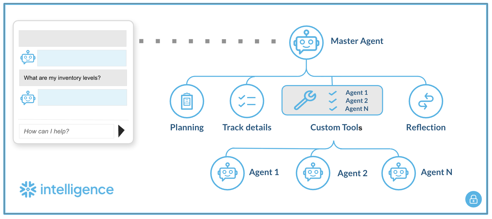

# Cortex Multi-Agent Orchestration

Route user queries to specialized Cortex Agents via a Master Agent using custom tools (UDFs).



## Prerequisites

- Snowflake account with Cortex enabled
- ACCOUNTADMIN role
- Sub-agents already created in Cortex
- Personal Access Token (PAT)

## Setup

### 1. Generate PAT Token

**User Menu** → **My Profile** → **Authentication** → **Generate Token**

### 2. Run SQL Setup

Edit `multi_agent_setup.sql` - replace placeholders, then execute:

| Placeholder | Example |
|-------------|---------|
| `<YOUR_ACCOUNT>` | `ABC12345` |
| `<YOUR_DATABASE>` | `MY_DB` |
| `<YOUR_SCHEMA>` | `AGENTS` |
| `<YOUR_AGENT_NAME>` | `SALES_AGENT` |
| `<YOUR_ROLE>` | `SYSADMIN` |
| `<YOUR_PAT_TOKEN>` | `eyJhbGci...` |

### 3. Create UDF per Sub-Agent

Duplicate the UDF template, change function name and URL for each agent.

### 4. Configure Master Agent (UI)

1. **AI & ML** → **Agents** → **+ Create Agent**

2. **About Tab** - Add description:
   ```
   A multi-domain routing agent that delegates user questions to specialized sub-agents based on query intent.
   ```

3. **Tools Tab** - Add custom tool for each sub-agent:
   ```
   Tool Name:     AGENT_1
   Function:      ASK_AGENT_1(VARCHAR)
   Warehouse:     <YOUR_WAREHOUSE>
   Description:   Handles [domain] queries
   ```

4. **Orchestration Tab** - Set routing prompt:
   ```
   You are an intelligent router. Analyze the user's inquiry:

   Agent 1: Use for [domain 1] questions.
   Agent 2: Use for [domain 2] questions.

   Rule: Do not answer yourself. Invoke the appropriate tool.
   ```

5. **Access Tab** - Grant access to roles/users who need to use the Master Agent.

## Usage

```sql
-- Direct sub-agent call (testing)
SELECT ASK_AGENT_1('Your question here');

-- Or query Master Agent via UI
```

## Notes

- Only Master Agent reasoning is visible; sub-agent internals are hidden
- Latency depends on sub-agent query complexity
- PAT tokens expire - regenerate as needed

## Troubleshooting

| Error | Cause | Solution |
|-------|-------|----------|
| `Could not read secret` | Missing grants | `GRANT READ ON SECRET ... TO ROLE` |
| `API Error 401` | Invalid/expired token | Regenerate PAT, update secret |
| `API Error 403` | Insufficient permissions | Check role has USAGE on agent |
| `Connection error` | Network rule issue | Verify network rule includes account URL |
| `Agent returned no text` | Agent config issue | Check sub-agent in UI |
| Tool not invoked | Orchestration prompt unclear | Refine routing instructions |

## Resources

- [Cortex Agents Docs](https://docs.snowflake.com/en/user-guide/snowflake-cortex/cortex-agents)
- [External Access Integrations](https://docs.snowflake.com/en/developer-guide/external-network-access/external-network-access-overview)
